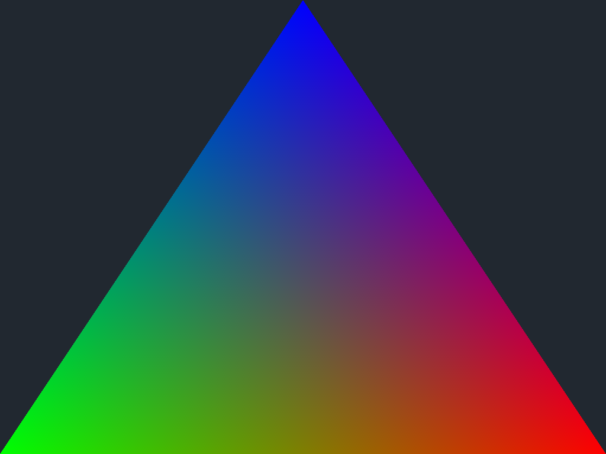
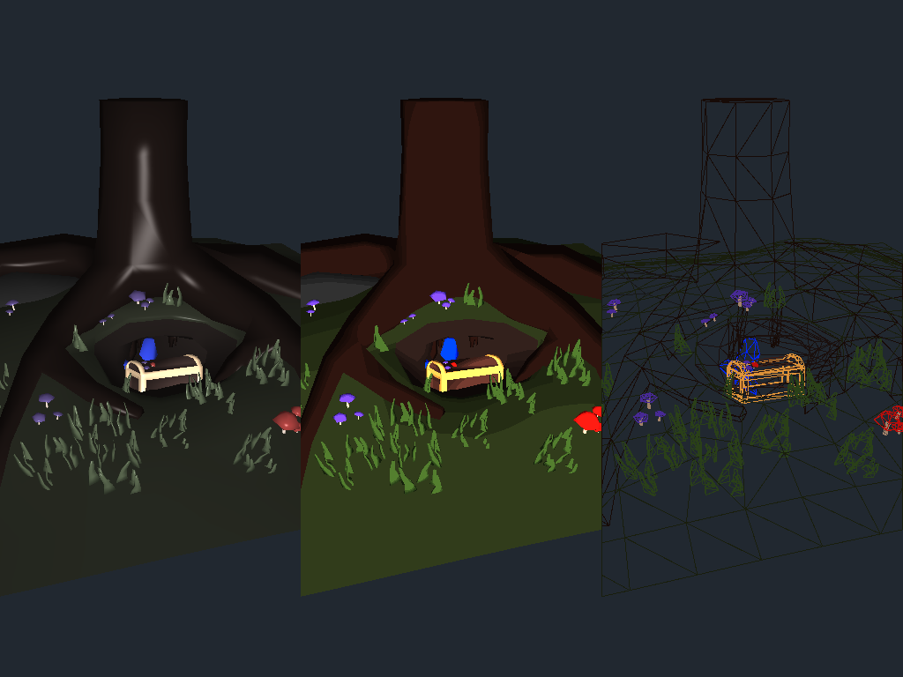
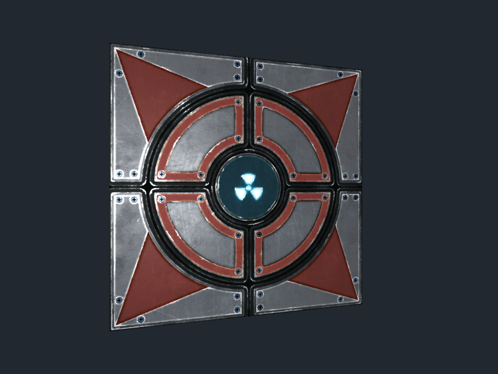
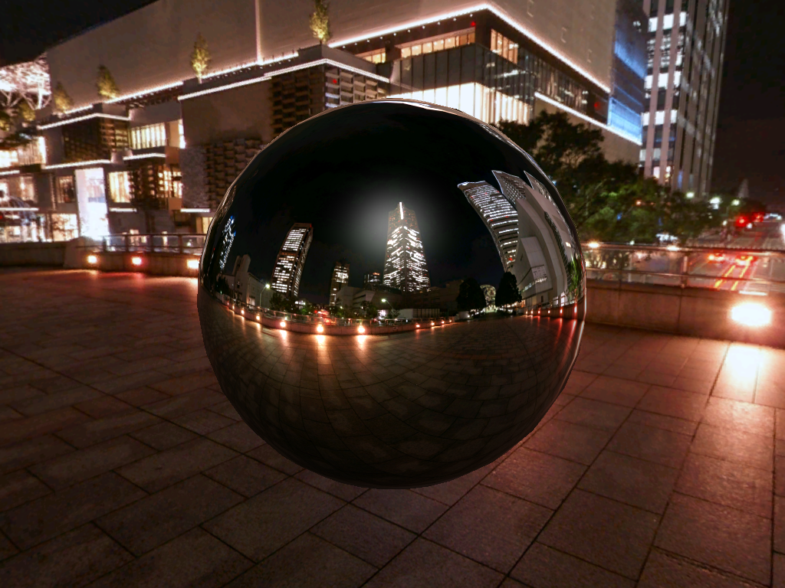
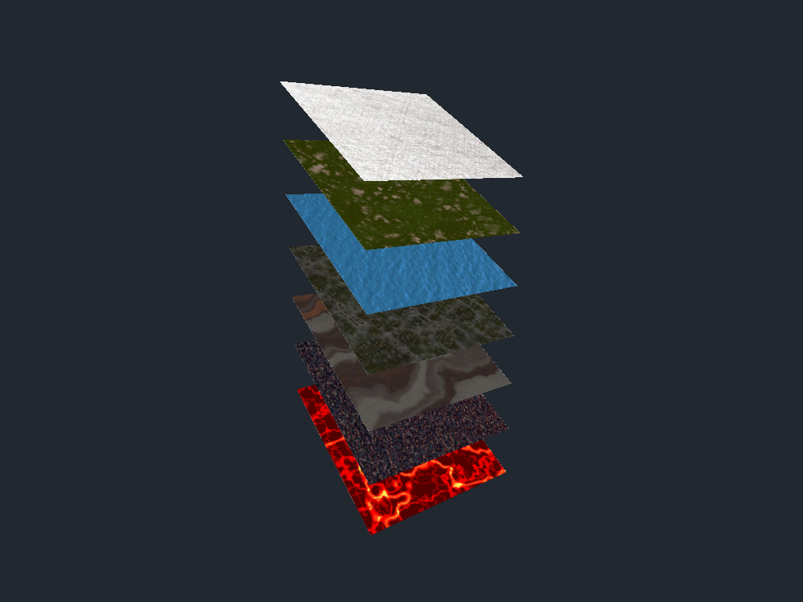
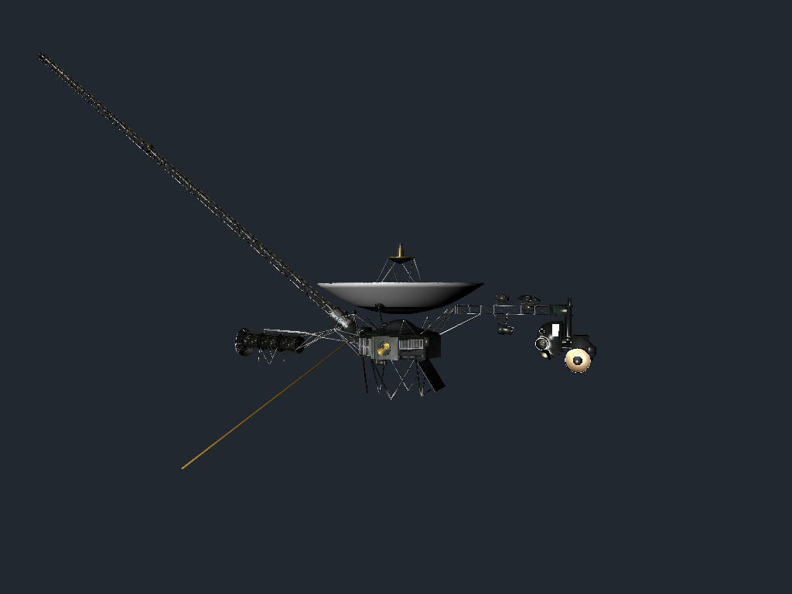
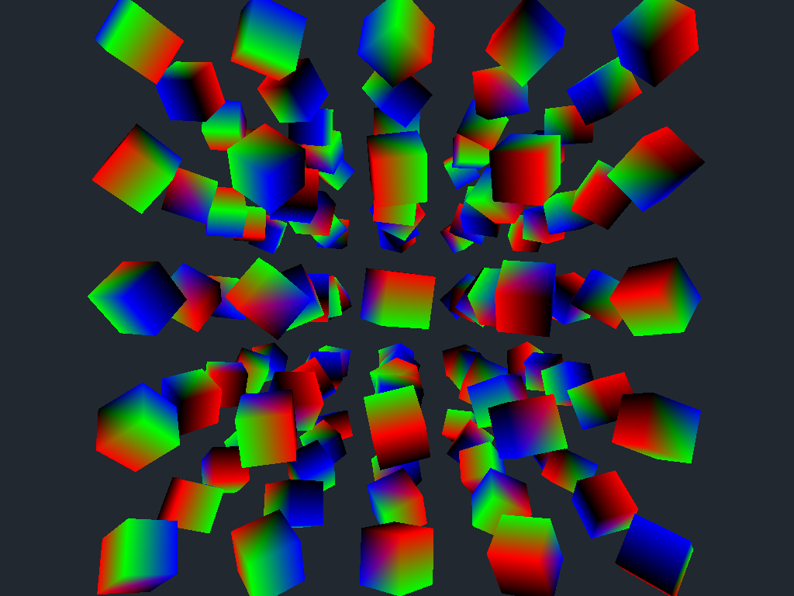
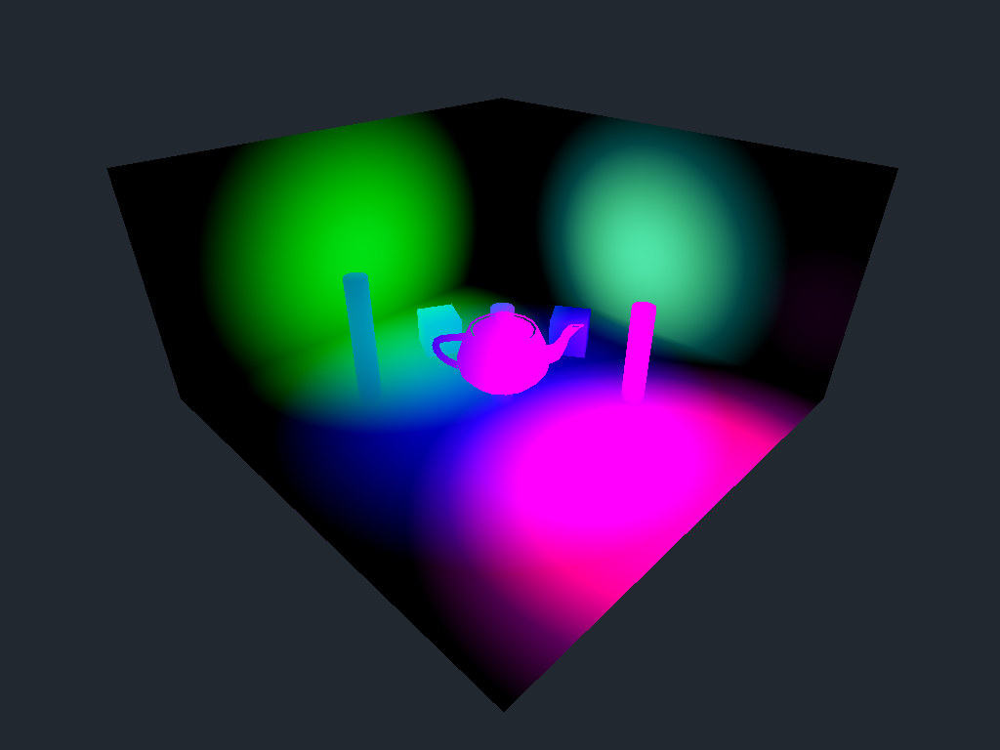
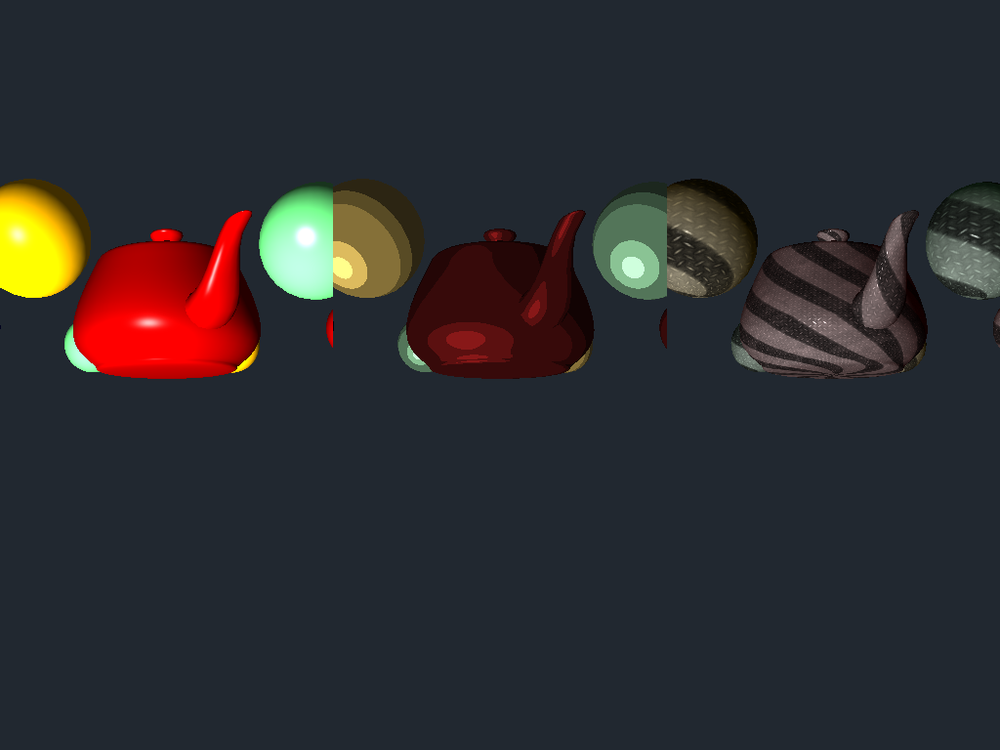

# vkpp: C++ Bindings for Vulkan
vkpp is a header only C++ bindings for the Vulkan C API aiming to improve
the developers' experience and efficiency without introducing extra
runtime costs.

## 
A Visual Studio 2017 solution file for compiling all examples is included with the repository.<br/>
Both the vkpp library and the examples use C++17 new features.

## 
Coming soon.

## 
Coming soon.

## Examples
The examples are used to verify and demonstrate the correctness, efficiency and effectiveness of vkpp.<br/>
They are also used as baselines to prevent regressions.<br/>

***Note: The examples below are originally created by [SaschaWillems](https://github.com/SaschaWillems/Vulkan). I rewrite some of the examples in order to verify vkpp's correctness, efficiency and effectiveness.***

### [Colorized Triangle](Sample/ColorizedTriangle/)


Draw a simple gradient triangle using staging buffers.

Vertex and index data are mapped to host visible memory (staging buffers) before they are transferred to device local memory.

### [Multi-Pipelines](Sample/MultiPipelines/)


Three different pipeline state objects are used here for rendering the same scene with different visual effects.

### [Textured Plate](Sample/TexturedPlate/)


Texture data, including all mip-levels, is mapped to host visible memory (staging buffer) before it is transferred to device local optimal image memory.

### [Textured Cube](Sample/TexturedCube/)


A cube map is a special type of image that allows groups of six layers of an array image to be interpreted as the side of a cube.<br/>
The faces are ofter noted as the -X, +X, -Y, +Y, -Z and +Z faces. These are the six faces of a cube map and a group of six consecutive array layers can be interpreted in that order.

Note that the number of layers in the array doesn't have to be a multiple of 6, but it has to be at least 6.

### [Textured Array](Sample/TexturedArray/)


Texture arrays allow storing of multiple images in different layers without any interpolation among the layers.<br/>
2D array texture is different from a 3D texture in that linear filtering can be performed in the z direction in a 3D texture, whereas filtering cannot be performed across multiple layers in an array image.

### [Mesh Renderer](Sample/MeshRenderer/)

Uses assimp to load a mesh from a common 3D format. The mesh data is then converted to a fixed layout matching the shader vertex attribute bindings.<br

[Voyager 1 and 2](https://voyager.jpl.nasa.gov/) are the most distant human-made objects. They are exploring where nothing from Earth has flown before.

### [Dynamic Uniform Buffer](Sample/DynamicUniformBuffer/)

Demonstrates the use of dynamic uniform buffers for rendering multiple objects with different matrices from one big uniform buffer object. Sets up one bug uniform buffer that contains multiple model matrices that are dynamically addressed upon descriptor binding time.<br/>
This minimizes the number of descriptor sets required and may help in optimizing memory writes by e.g. only doing partial updates to that memory.<br/>
It is very practical to use when sub-allocating uniform buffers from a larger buffer allocation.

### [Push Constants](Sample/PushConstants/)

Push Constants are uniform values that are stored within the CommandBuffer and can be accessed from the shaders similar to a single global uniform buffer. They provide enough bytes to hold some matrices or index values and the interpretation of the raw data is up the shader. `The values are recorded with the CommandBuffer and cannot be altered afterwards.`

### [Specialization Constants](Sample/SpecializationConstants/)

Specialization Constants are used to specify shader constants at pipeline creation time.<br/>
Shader bindings based on specialization constants are marked by the new `constant_id` layout qualifier. For example:<br/>
```C
    layout (constant_id = 0) const int LightModel = 0;
```

Specialization info is assigned as part of the shader stage and must be set after creating the shader module and before creating the pipeline.

## Credits
Thanks to the authors of these libraries:
 - [Examples and demos for the new Vulkan API](https://github.com/SaschaWillems/Vulkan)
 - [OpenGL Mathematics (GLM)](https://github.com/g-truc/glm)
 - [stb single-file public domain libraries for C/C++](https://github.com/nothings/stb)
 - [Open Asset Import Library](https://github.com/assimp/assimp)
 - [Simple DirectMedia Layer](https://www.libsdl.org/)

## License
vkpp is provided under MIT license that can be found in the ``LICENSE.txt``
file. By using, distributing, or contributing to this project,
you agree to the terms and conditions of this license.
