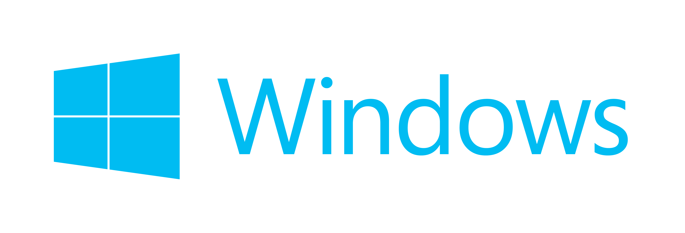

# vkpp: C++ Bindings for Vulkan
vkpp is a header only C++ bindings for the Vulkan C API aiming to improve
the developers' experience and efficiency without introducing extra
runtime costs.

## 
A Visual Studio 2017 solution file for compiling all examples is included with the repository.
Both the vkpp library and the examples adopted C++17 new features.

## 
Coming soon.

## 
Coming soon.

## Examples
The examples are used to verify and demonstrate the efficiency, effectiveness and correctness of vkpp.

They are also used as baselines to prevent regressions.

(Note: Some examples are broken due to recent API changes.)

### [ClearFrame](Sample/ClearFrame/)

### [StagingTriangle](Sample/StagingTriangle/)

### [IndexedTriangle](Sample/IndexedTriangle/)

### [UniformTriangle](Sample/UniformTriangle/)

### [TexturedTriangle](Sample/TexturedTriangle/)

### [DepthTriangle](Sample/DepthTriangle/)

## Credits
Thanks to the authors of these libraries:
 - [OpenGL Mathematics (GLM)](https://github.com/g-truc/glm)
 - [stb single-file public domain libraries for C/C++](https://github.com/nothings/stb)
 - [Examples and demos for the new Vulkan API](https://github.com/SaschaWillems/Vulkan)

## License
vkpp is provided under MIT license that can be found in the ``LICENSE.txt``
file. By using, distributing, or contributing to this project,
you agree to the terms and conditions of this license.
